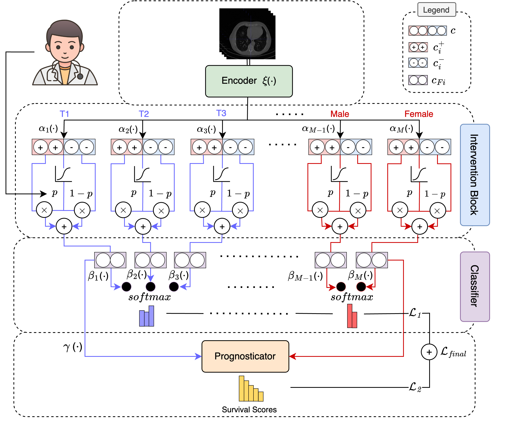

# HuLP: Human-in-the-Loop for Prognosis
Muhammad Ridzuan, Mai A. Shaaban, Numan Saeed, Ikboljon Sobirov, Mohammad Yaqub

**Mohamed bin Zayed University of Artificial Intelligence, Abu Dhabi, UAE**

[](https://arxiv.org/abs/2403.13078)

<hr>



<hr>

## :bulb: Highlights

* *Allowing user interaction and expert intervention at inference time:* HuLP facilitates human expert intervention during model inference, empowering clinicians to provide input and guidance based on their domain expertise. This capability significantly enhances the model's decision-making process, particularly in complex prognostic scenarios where expert knowledge is invaluable.
* *Capability of handling both missing covariates and outcomes and extract of meaningful vector representations for prognosis:* HuLP is equipped with a robust mechanism for handling missing data, ensuring end-to-end reliability in prognostic predictions. By leveraging patients' clinical information as intermediate concept labels, our model generates richer representations of clinical features, thereby enhancing prognostic accuracy.


## :hammer_and_wrench: Install  

Create environment:  
 ```conda create -n hulp python=3.8```

Install dependencies: (we assume GPU device / cuda available):

```pip install -r requirements.txt```  

Now, you should be all set.

## :arrow_forward: Demo  
Run the following for *Hecktor* dataset:

```python train.py --model PrognosisModel --fold 0 --seed 0 --dataset_name hecktor --mtlr_loss deephit --image_only False``` 

Run the following for *Lung cancer* dataset:

```python train.py --model PrognosisModel --fold 0 --seed 0 --dataset_name lung --mtlr_loss deephit --image_only False```


## :black_nib: Citation

If you find our work helpful for your research, please consider citing the following BibTeX entry.   

```bibtex
@article{ridzuan2024hulp,
  title={HuLP: Human-in-the-Loop for Prognosis},
  author={Ridzuan, Muhammad and Kassem, Mai and Saeed, Numan and Sobirov, Ikboljon and Yaqub, Mohammad},
  journal={arXiv preprint arXiv:2403.13078},
  year={2024}
}
```